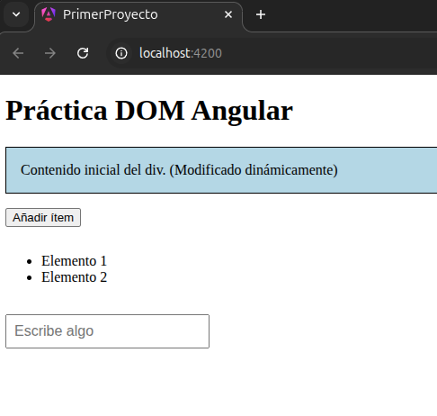

# Primer proyecto en Angular

## Aplicación en distintos navegadores

**Firefox**

**Google Chrome**

## Visualización al interactuar con los elementos

## TS @ViewChild
Entender cómo el código TS accede y modifica el DOM a través de @ViewChild y maneja
eventos nativos de Angular

## Uso de `@ViewChild` y manejo de eventos nativos en TypeScript

- **Acceso al DOM con `@ViewChild`:** En el componente (`src/app/app.ts`) se declara
	`@ViewChild('content') contentRef!: ElementRef<HTMLDivElement>;`. Esto enlaza la
	referencia de plantilla `#content` (en `app.html`) con la propiedad `contentRef`.
	Después de que Angular inicializa la vista, en `ngAfterViewInit()` se puede acceder
	al elemento nativo a través de `this.contentRef.nativeElement`.

- **Modificar el DOM desde TypeScript:** Con `this.contentRef.nativeElement` el código
	cambia estilos y contenido directamente, por ejemplo:

	- `this.contentRef.nativeElement.style.backgroundColor = 'lightblue';`
	- `this.contentRef.nativeElement.textContent += ' (Modificado dinámicamente)';`

- **Manejo de eventos nativos con binding de Angular:** En la plantilla (`app.html`)
	se usan bindings de eventos como `(click)="addItem()"` y `(input)="onInputChange($event)"`.
	- El binding `(click)` llama al método `addItem()` definido en el componente.
	- El binding `(input)` recibe el objeto `$event`; en el componente se convierte el
		`event.target` a `HTMLInputElement` para leer su `value`:
		`const target = event.target as HTMLInputElement; this.inputText = target.value;`.

- **Directivas estructurales y módulos:** La plantilla usa `*ngFor` para iterar sobre
	`items`. Cuando se usa `bootstrapApplication()` y componentes `standalone`, es
	necesario importar `CommonModule` (o `NgFor`) en las `imports` del componente
	para que `*ngFor` esté disponible.
